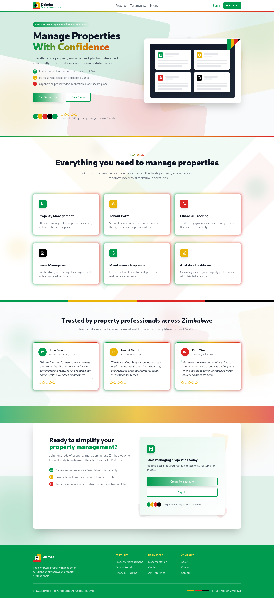
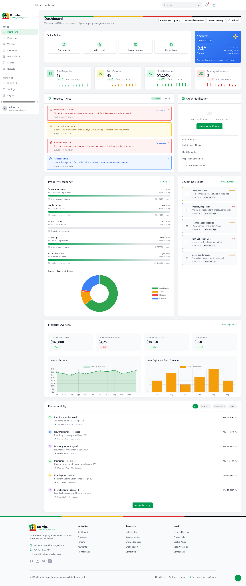
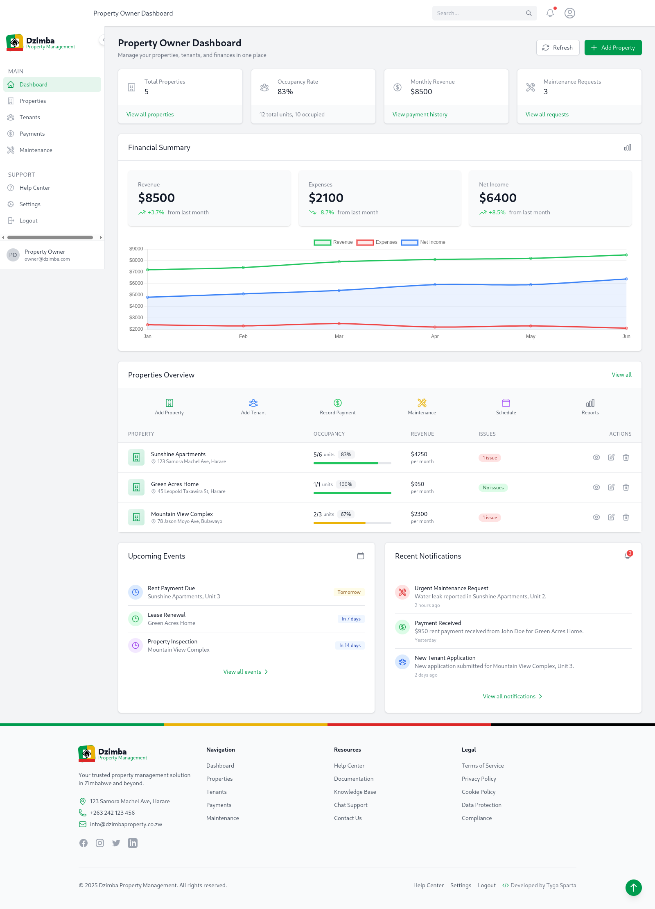
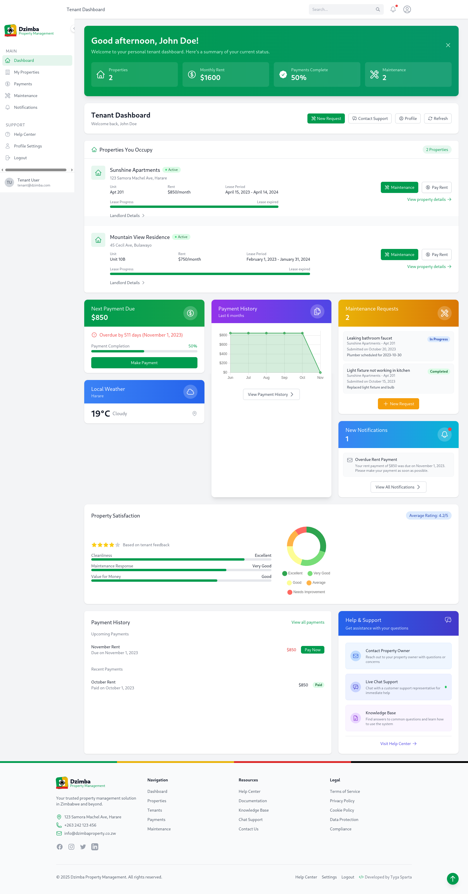

# Dzimba Property Management System

A comprehensive property management solution designed to streamline the management of rental properties, tenants, and maintenance requests.

## Features

- **Role-Based Access Control**: Different interfaces for property owners, tenants, and administrators
- **Property Management**: Add, edit, and manage multiple properties
- **Tenant Management**: Track tenant information, leases, and payments
- **Maintenance Requests**: Allow tenants to submit and track maintenance requests
- **Payment Processing**: Record and track rent payments
- **Dashboard**: Visual overview of property performance and occupancy
- **User Profiles**: Customizable user settings and preferences

## Technology Stack

- React.js for the frontend
- Node.js and Express for the backend
- MongoDB for database
- JWT for authentication

## Screenshots






## Installation

1. Clone the repository:
   ```
   git clone https://github.com/tygasparta/dzimba-property-management.git
   ```

2. Install dependencies:
   ```
   cd dzimba-property-management
   npm install
   ```

3. Set up environment variables:
   ```
   cp .env.example .env
   ```
   Edit the `.env` file with your configuration.

4. Start the development server:
   ```
   npm start
   ```

## Usage

After installation, you can access the application at `http://localhost:3000`.

### Demo Accounts:
- **Admin Login**: Use admin@dzimba.com / password
- **Property Owner Login**: Use owner@dzimba.com / password
- **Tenant Login**: Use tenant@dzimba.com / password

## Contributing

Contributions are welcome! Please feel free to submit a Pull Request.

## License

This project is licensed under the MIT License - see the LICENSE file for details.
